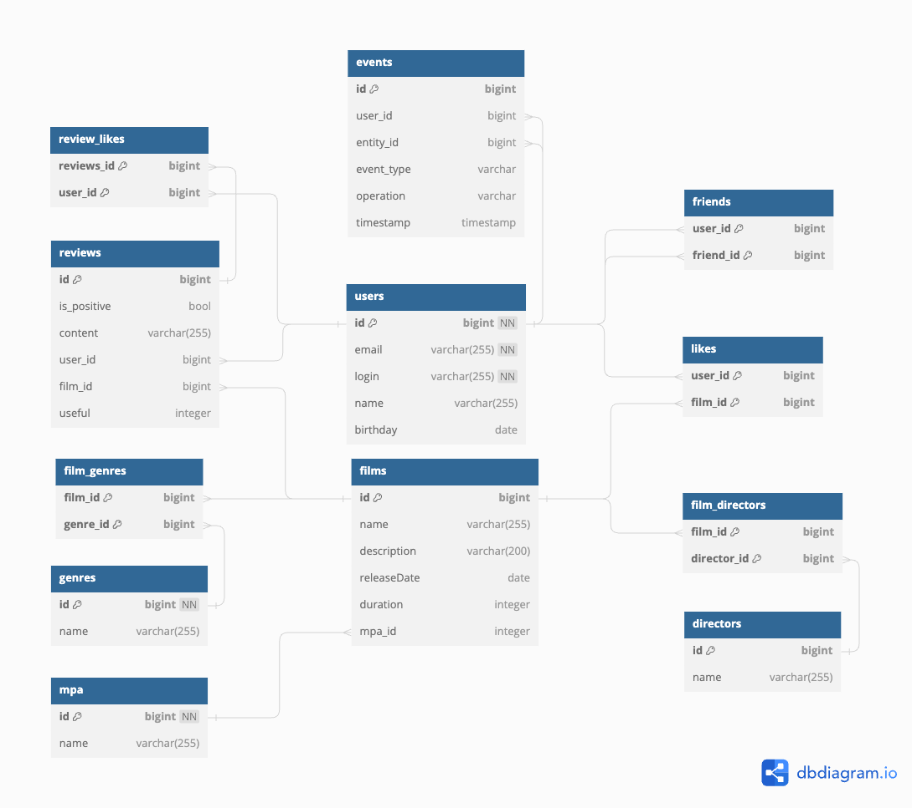

# Filmorate

_Платформа для обсуждения фильмов, возможность делиться отзывами, отслеживать, какие фильмы пользователям нравятся, а также позволяет пользователям создавать список друзей в контексте кинематографических интересов._

- **users**: Хранит информацию о пользователях.
- **films**: Содержит информацию о фильмах.
- **film_genres** и **genres**: Описывает жанры фильмов.
- **film_directors** и **directors**: Cвязывает фильмы с их режиссерами.
- **likes**: Отражает, какие фильмы нравятся пользователям.
- **reviews** и **review_likes**: Служат для хранения отзывов о фильмах, показывают, сочли ли другие пользователи отзывы полезными.
- **friends**: Позволяет пользователям добавлять друг друга в друзья или подписываться друг на друга.
- **events**: Может отслеживать различные события, связанные с пользовательскими действиями, такие как создание отзыва или лайк фильма.
